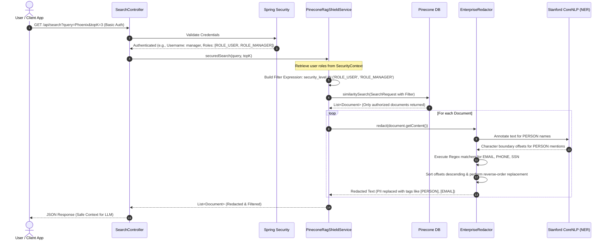

# RAG-Shield: Enterprise Security Middleware for RAG Pipelines

RAG-Shield is a Java 21 / Spring Boot 3.x security middleware designed to secure Retrieval-Augmented Generation (RAG) pipelines. It intercepts semantic searches on Vector Databases to implement **Pre-Retrieval Role-Based Access Control (RBAC) Filtering** and **Post-Retrieval PII Redaction**, protecting sensitive user information and corporate IP before context is sent to Large Language Models (LLMs).

---

## 📋 Prerequisites

Before running the application, ensure you have:
*   **Java Development Kit (JDK) 21+** installed and configured on your `PATH`.
*   **Apache Maven 3.8+** installed.
*   **Pinecone Serverless Index** set up with the following specifications:
    *   **Index Name:** `rag-shield-index`
    *   **Dimension Size:** `1024` dimensions (for `multilingual-e5-large`)
    *   **Metric:** `Cosine`

---

## 🏗️ Core Interaction Flow

Here is the high-level security flow demonstrating how Spring Security, the Pinecone Vector Filter, and the Stanford CoreNLP Redactor work together to protect data:

```mermaid
graph LR
    User[User Request] -->|Authenticate| Security[Spring Security]
    Security -->|Extract Roles / Authorities| Filter[Pinecone Metadata Filter]
    Filter -->|Query Index with security_level Filter| Pinecone[(Pinecone Vector Index)]
    Pinecone -->|Fetch Authorized Context Chunks| Redactor[Stanford CoreNLP Redactor]
    Redactor -->|NLP & Regex PII Cleaning| Clean[Safe LLM Context]

    style Security fill:#f9f,stroke:#333,stroke-width:2px
    style Filter fill:#bbf,stroke:#333,stroke-width:2px
    style Redactor fill:#fbf,stroke:#333,stroke-width:2px
```



---

## ⚡ Quickstart Commands

### 1. Clone the Project
```bash
git clone <repository-url>
cd rag-shield-core
```

### 2. Configure Environment Variables
To connect to your live Pinecone instance, set the required configurations in your terminal:

#### Windows PowerShell:
```powershell
$env:RAGSHIELD_MOCK="false"
$env:PINECONE_API_KEY="YOUR_PINECONE_API_KEY"
$env:PINECONE_ENVIRONMENT=""
$env:PINECONE_PROJECT_ID=""
```

#### Windows Command Prompt (CMD):
```cmd
set RAGSHIELD_MOCK=false
set PINECONE_API_KEY=YOUR_PINECONE_API_KEY
set PINECONE_ENVIRONMENT=<>
set PINECONE_PROJECT_ID=<>
```

---

### 3. Run the Application

#### Option A: Run in Mock/Offline Mode (Default)
Runs completely offline using local mock data. Ideal for immediate local validation and checking API endpoints:
```bash
mvn spring-boot:run
```

#### Option B: Run in Live Mode (Connecting to Pinecone)
Uses the environment variables configured in Step 2 to establish a live connection to your Pinecone serverless index:
```bash
# If RAGSHIELD_MOCK is set to false in env, run:
mvn spring-boot:run

# Or run directly by overriding the property:
mvn spring-boot:run -Dragshield.mock=false
```

---

### 4. Test API Endpoints (cURL)

#### Ingest / Upsert Documents into Vector Store
Execute these POST requests to ingest documents with different security levels:
*   **Ingest `ROLE_USER` level document:**
    ```bash
    curl -X POST -u admin:password "http://localhost:8080/api/search/ingest?content=Confidential+report+for+John+Doe.+Secure+email+is+john@corp.com.+Phone:+555-019-2834.&securityLevel=ROLE_USER"
    ```
*   **Ingest `ROLE_MANAGER` level document:**
    ```bash
    curl -X POST -u admin:password "http://localhost:8080/api/search/ingest?content=Executive+salary+budget+detailing+Alice+Vance+earning+150k.+Contact:+555-888-2940.&securityLevel=ROLE_MANAGER"
    ```
*   **Ingest `ROLE_ADMIN` level document:**
    ```bash
    curl -X POST -u admin:password "http://localhost:8080/api/search/ingest?content=Admin+eyes+only+project+details.+Chief+architect+is+Bob+Jones.+SSN:+000-12-3456.&securityLevel=ROLE_ADMIN"
    ```

#### Search as a Standard User (`ROLE_USER`)
Retrieves only public/user-level data and redacts name, phone, and email information:
```bash
curl -u user:password "http://localhost:8080/api/search?query=contracts&topK=3"
```

---

## 🎯 Project Intent

When deploying corporate RAG applications, two major security vulnerabilities emerge:
1.  **Privilege Escalation (Data Leakage via Search)**: Users without permissions can retrieve sensitive records if vector searches lack access control filters.
2.  **PII Leakage to Third-Party LLMs**: Semantic chunks fetched from vector stores often contain personally identifiable information (PII) like customer names, emails, phone numbers, and Social Security Numbers. Sending this raw data to public LLM APIs violates compliance standards (e.g., GDPR, HIPAA, PCI-DSS).

**RAG-Shield** resolves both concerns at the middleware layer, acting as a security proxy between the client query, the Pinecone Vector Store, and the downstream LLM.

---

## 💎 Benefits of RAG-Shield

*   **Zero-Trust Retrieval (Pre-Retrieval RBAC)**: Integrates directly with Spring Security to inspect authenticated user authorities at runtime. Automatically appends metadata filter criteria (e.g., `security_level == 'ROLE'`) to the vector database query, ensuring users only retrieve data they are authorized to see.
*   **Dual-Engine PII Redaction (Post-Retrieval)**: Integrates Stanford CoreNLP's statistical Named Entity Recognition (NER) models for context-aware classification (like `PERSON` names) with highly optimized Java Regex patterns for structured alphanumeric formats (`EMAIL`, `PHONE`, `SSN`).
*   **Preventing Text Shift Conflicts**: Performs offset-based replacements using a descending-order substitution algorithm. This ensures that changing the length of one redacted term does not misalign or corrupt the boundaries of subsequent PII detections in the document.
*   **Mockable Integration Environment**: Contains a built-in mock profile and mock vector store configuration that simulates semantic search behavior and filtering offline, enabling immediate validation without external DNS/network dependencies.

---

## 📂 Directory Structure

```text
rag-shield-core/
├── pom.xml                                  # Project dependencies (Spring Boot, Spring Security, Spring AI, Stanford CoreNLP)
└── src/
    ├── main/
    │   ├── java/
    │   │   └── com/
    │   │       └── security/
    │   │           └── ragshield/
    │   │               ├── RagShieldApplication.java  # Application main entry point
    │   │               ├── config/
    │   │               │   ├── CoreNlpConfig.java     # Configures StanfordCoreNLP pipeline bean
    │   │               │   ├── SecurityConfig.java    # Configures Spring Security and InMemory User Roles
    │   │               │   ├── EmbeddingModelConfig.java # Dummy 1024-dimension EmbeddingModel bean for startup
    │   │               │   └── MockVectorStoreConfig.java# Offline VectorStore with preloaded security-tagged docs
    │   │               ├── controller/
    │   │               │   └── SearchController.java  # REST API exposing /api/search and /api/search/ingest
    │   │               └── service/
    │   │                   ├── EnterpriseRedactor.java# PII engine redacting PERSON, EMAIL, PHONE, SSN
    │   │                   └── PineconeRagShieldService.java # Main intercepting query service
    │   └── resources/
    │       └── application.yml              # Pinecone index properties and active profile configurations
    └── test/
        └── java/
            └── com/
                └── security/
                    └── ragshield/
                        ├── RagShieldApplicationTests.java  # Spring Boot Context load verification
                        └── service/
                            ├── EnterpriseRedactorTest.java  # Tests PII NLP/Regex rules
                            └── PineconeRagShieldServiceTest.java # Tests Security Context role extraction and filters
```

---

## 🏗️ Detailed System Architecture

The following diagram illustrates the structural layout of RAG-Shield components:

```mermaid
graph TD
    subgraph Client Space
        Client[HTTP Client / RAG App]
    end

    subgraph Security Middleware (RAG-Shield)
        Controller[SearchController]
        SecurityContext[Spring Security Context]
        Service[PineconeRagShieldService]
        Config[CoreNlpConfig / SecurityConfig]
        Redactor[EnterpriseRedactor]
        NLP[Stanford CoreNLP Pipeline]
        Regex[Regex PII Engines]
    end

    subgraph Vector Database
        Pinecone[(Pinecone Serverless Index)]
    end

    Client -->|1. GET /api/search with Auth| Controller
    Controller -->|2. Check User Roles| SecurityContext
    Controller -->|3. Query| Service
    Service -->|4. Pull Roles| SecurityContext
    Service -->|5. Build Metadata Filters| Service
    Service -->|6. Query with Filter Expression| Pinecone
    Pinecone -->|7. Return Authorized Document Chunks| Service
    Service -->|8. Raw Text Chunks| Redactor
    Redactor -->|9. NLP NER Name Extraction| NLP
    Redactor -->|10. Pattern Matching| Regex
    Redactor -->|11. Perform Safe Redaction| Redactor
    Service -->|12. Return Redacted Context| Controller
    Controller -->|13. JSON Response| Client
```

---

## 🔄 Execution Sequence Diagram

This flow diagram illustrates the end-to-end execution path when a user submits a query to RAG-Shield:


